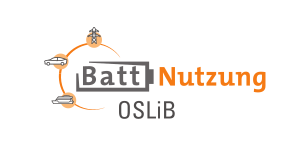

# EIS Data Analytics

<a href="https://www.carl.rwth-aachen.de/?lidx=1" target="_blank">
    
</a>

[](https://opensource.org/licenses/MIT)

*EIS Data Analytics* is a collection of code to analyse which fitting approach is suitable for your electrochemical impedance spectroscopy (EIS) data.

- [Getting Started](README.md#getting-started)
- [Example Usage](README.md#example-usage)
- [Overview](README.md#overview)
- [Colophon](README.md#colophon)
- [Further Information](README.md#further-information)
- [FAQ](README.md#faq)


# Getting Started
1.  Clone the project into your "path_to_this_project". Clone the submodules is important here:
	```bash
    git clone --recurse-submodules https://git.rwth-aachen.de/alexander.bloemeke/eis_eval_tool.git path_to_this_projectpreparation
    ```
2. Install Python 3.11.8 (https://www.python.org/downloads/)
3. Open an prompt and navigate to the path of this project
    ```bash
    cd path_to_this_project
    ```
4. Follow the instructions of the [Python Read the Docs](https://docs.python.org/3.11/library/venv.html) to create an virtual environment (venv) and activate it. E.g.:  
	**Windows**
    ```bash
    python -m venv .venv\eis_data_analytics
    .venv\eis_data_analytics\Scripts\activate
    ```
    **Linux / Mac**
    ```bash
    python -m venv .venv/eis_data_analytics
    .venv/eis_data_analytics/bin/activate
    ```

5. Install all necessary packages with:  
    **Windows**
	```bash
    pip install -r requirements_windows.txt
    ```
    **Linux / Mac**
	```bash
    pip install -r requirements.txt
    ```
6. (Optional) Clean up your venv:
	```bash
    python -m pip cache purge
    ```
7. Open this project with an Jupyter-Notebook editor of your choice, e.g. [VS Code](https://code.visualstudio.com/Download) (needs to be installed separatly) with:
    ```bash
    code
    ```

# Example Usage
Details and step-by-step explanations can be found in the Jupyter Notebooks:
1. [a_data_preparation.ipynb](a_data_preparation.ipynb)
2. [b_data_inspection.ipynb](b_data_inspection.ipynb)
3. [c_input_data_definition.ipynb](c_input_data_definition.ipynb)
4. [d_regression_analysis_individual_frequencies.ipynb](d_regression_analysis_individual_frequencies.ipynb)
5. [e_regression_analysis_frequency_spectrum.ipynb](e_regression_analysis_frequency_spectrum.ipynb)


# Overview
The main purpose of this tool is to process and analyze large amounts of EIS measurements. This implies that compromises have to be made in some respects. The following functions are already implemented:
- Standardization of the frequency measuring points by interpolation
- LinKK
- ECM fitting
- DRT fitting
- Impedance extrema extraction
- Various forms of visualization
- Support Vector Regression (SVR)

Will follow soon:
- Analysis of variance (ANOVA)
- Prediction based on machine learning (ML)

# Colophon

Thanks to Spyridon, Xiaohan and Jacob who supported us, <a href="https://orcid.org/0000-0001-8394-5859">Ole Kappelhoff </a> and <a href="https://orcid.org/0000-0003-0943-9485">Alexander Blömeke </a>.

We are using [impedance.py](https://github.com/ECSHackWeek/impedance.py) for LinKK calculations and RC fitting: https://doi.org/10.21105/joss.02349.
For DRT calculations we use [pyDRTtools](https://github.com/ciuccislab/pyDRTtools): https://doi.org/10.1016/j.electacta.2019.135316.

## Related Publications / Citation

A corresponding paper is currently being reviewed. For now please cite the following version:  

Release v0.0.9: https://doi.org/10.18154/RWTH-2024-03849

## License

This project is licensed according to the file [LICENSE](/LICENSE "LICENSE").

## Acknowledgement

The authors acknowledge the financial support by the Federal Ministry of Education and Research (BMBF) of Germany in the project OSLiB (project number 03X90330A) within the competence cluster Battery Utilisation Concepts (BattNutzung).


<a href="https://www.bmbf.de/bmbf/en" target="_blank">
    
</a>
<a href="https://www.battnutzung-cluster.de/en/projects/oslib/" target="_blank">
    
</a>


# Further Information


## Developer Info

We use Git Large File Storage (LFS).

This project is written in [Python 3.11.8](https://www.python.org/) using [Visual Studio Code](https://code.visualstudio.com/) and [Jupyter Notebooks](https://jupyter.org/) in an Python virtual environment on Windows.
A [requirements.txt](requirements.txt) can be created by:

```bash
pip freeze -l > requirements.txt
```

## Git and Jupyter Notebooks
Consider to ignore the Jupyter Outputs in Git:

```bash
git config filter.strip-notebook-output.clean 'jupyter nbconvert --ClearOutputPreprocessor.enabled=True --to=notebook --stdin --stdout --log-level=ERROR'
```

# FAQ
- pywin32 fails: https://github.com/microsoft/vscode-jupyter/wiki/Failure-to-start-kernel-due-to-failures-related-to-win32api-module
- general_fun_v8 can't be found: Make sure you loaded the submodule. See step 1. at [Getting Started](README.md#getting-started)