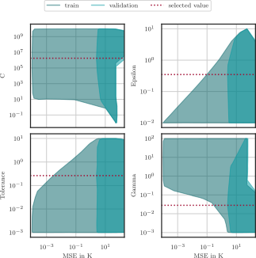
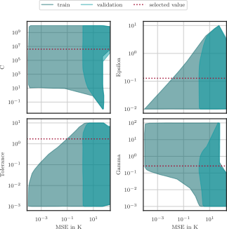
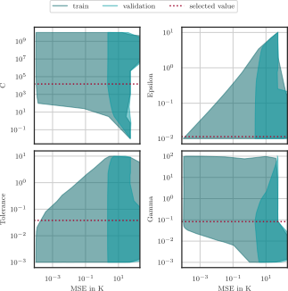

# EIS Data Analytics

<a href="https://www.carl.rwth-aachen.de/?lidx=1" target="_blank">
    
</a>

[](https://opensource.org/licenses/MIT) [](https://mybinder.org/v2/git/https%3A%2F%2Fgit.rwth-aachen.de%2Fisea%2Feis_data_analytics/main)

*EIS Data Analytics* is a collection of code to analyze which fitting approach is suitable for your electrochemical impedance spectroscopy (EIS) data.  
<a href="https://doi.org/10.1016/j.jpowsour.2024.235049" target="_blank">
 [1](README.md#sources)
</a>  

- [EIS Data Analytics](#eis-data-analytics)
- [Overview](#overview)
- [Getting Started](#getting-started)
  - [Binder](#binder)
  - [Python](#python)
  - [Microcontroller (µC)](#microcontroller-µc)
- [Example Usage](#example-usage)
- [Data](#data)
- [Temperature Estimation](#temperature-estimation)
- [Verification](#verification)
- [Colophon](#colophon)
  - [Related Publications / Citation](#related-publications--citation)
  - [License](#license)
  - [Acknowledgement](#acknowledgement)
- [Further Information](#further-information)
  - [Developer Info](#developer-info)
  - [Git and Jupyter Notebooks](#git-and-jupyter-notebooks)
- [FAQ](#faq)
- [Sources](#sources)

# Overview
The main purpose of this tool is to process and analyze large amounts of EIS measurements. This implies that compromises have to be made in some respects. The following functions are already implemented:
- Standardization of the frequency measuring points by interpolation
- LinKK
- ECM fitting
- DRT fitting
- Impedance extrema extraction
- Various forms of visualization
- SOC, SOH, Temperature, Phase and other parameter predictions
  - Linear Regression [SISO, MISO, MIMO]
  - Elastic Net Linear Regression [SISO, MISO, MIMO]
  - Support Vector Classification (SVC) [SISO, MISO]
  - Support Vector Regression (SVR)  [SISO, MISO, MIMO]
  - Multi-layer Perceptron (MLP) Regression [MISO, MIMO]
- Microcontroller (µC) code for SOC, SOH, Temperature, Phase and other parameter predictions
  - Linear Regression [SISO, MISO, MIMO]
  - Elastic Net Linear Regression [SISO, MISO, MIMO]
  - Support Vector Regression (SVR)  [SISO, MISO]
  - Multi-layer Perceptron (MLP) Regression [MISO, MIMO]

# Getting Started
## Binder
Launch the project by clicking on the badge: [](https://mybinder.org/v2/git/https%3A%2F%2Fgit.rwth-aachen.de%2Fisea%2Feis_data_analytics/main) .  
If you want to process a lot of data or run it on the microcontroller, please run it on your hardware.

## Python
1.  Clone the project into your "path_to_this_project". Clone the submodules is important here:
	```bash
    git clone --recurse-submodules https://git.rwth-aachen.de/isea/eis_data_analytics.git
    ```
2. Install Python 3.11.9 (https://www.python.org/downloads/)
3. Open a prompt and navigate to the path of this project
    ```bash
    cd path_to_this_project
    ```
4. Follow the instructions of the [Python Read the Docs](https://docs.python.org/3.11/library/venv.html) to create a virtual environment (venv) and activate it. E.g.:  
	**Windows**
    ```bash
    python -m venv .venv
    .\.venv\Scripts\activate
    ```
    **Linux / Mac**
    ```bash
    python -m venv .venv
    . .venv/bin/activate
    ```

5. Install all necessary packages with:  
    **Windows**
	```bash
    pip install -r requirements_windows.txt
    ```
    **Linux / Mac**
	```bash
    pip install -r requirements.txt
    ```
6. (Optional) Clean up your venv:
	```bash
    python -m pip cache purge
    ```
7. Open this project with a Jupyter-Notebook editor of your choice, e.g. [VS Code](https://code.visualstudio.com/Download) (needs to be installed separately) with:
    ```bash
    code
    ```

## Microcontroller (µC)
The code is written for the NUCLEO-F429ZI by ST. The µC STM32F429 was also used by the [foxBMS 1](https://foxbms.org/). Most of the custom code is optimized for the ARM Cortex-M4 core with a floating point unit (FPU) using the Common Microcontroller Software Interface Standard (CMSIS) library for vector operations. The following software versions are used during development:
- STM32CubeIDE 1.16.1
- STM32CubeMX 6.12.1
- STM32Cube.AI 9.1.0
- STM32Cube_FW_F4_V1.28.1
- CMSIS 5.7.0 (including CMSIS-DSP 1.8.0)

See also the [README.md](microcontroller_eis_network/README.md) in the microcontroller_eis_network folder.

# Example Usage
The Jupyter Notebooks contain details and step-by-step explanations. However, the data must first be analyzed.
1. [a_data_preparation.ipynb](a_data_preparation.ipynb) [Runtime with ```search_filters = ["LiFun_575166-01"]``` Intel i7-1265U: 4.8 hours; Intel W-2295: 1 hour]
2. [b_data_inspection.ipynb](b_data_inspection.ipynb)

Afterwards, Single-Input Single-Output (SISO), Multiple-Input Single-Output (MISO), and multiple-input multiple-output (MIMO) models can be fitted. 

- [d_SISO_Linear.ipynb](d_SISO_Linear.ipynb)
- [e_SISO_ElasticNet.ipynb](e_SISO_ElasticNet.ipynb)
- [f_SISO_SVC.ipynb](f_SISO_SVC.ipynb)
- [g_SISO_SVR.ipynb](g_SISO_SVR.ipynb)
- [h_MISO_Linear.ipynb](h_MISO_Linear.ipynb)
- [i_MISO_ElasticNet.ipynb](i_MISO_ElasticNet.ipynb)
- [j_MISO_SVC.ipynb](j_MISO_SVC.ipynb)
- [k_MISO_SVR.ipynb](k_MISO_SVR.ipynb)
- [l_MISO_MLPRegressor.ipynb](l_MISO_MLPRegressor.ipynb)
- [m_MIMO_Linear.ipynb](m_MIMO_Linear.ipynb)
- [n_MIMO_MTElasticNet.ipynb](n_MIMO_MTElasticNet.ipynb)
- [o_MIMO_MultiOutputRegressor_SVR.ipynb](o_MIMO_MultiOutputRegressor_SVR.ipynb)
- [p_MIMO_MLPRegressor.ipynb](p_MIMO_MLPRegressor.ipynb)


# Data

| **Name Pattern**                      | **Temperature (°C)**           | **SOC (%)**                                              | **SOH (%)**         | **Cite**               |
| ------------------------------------- | ------------------------------ | -------------------------------------------------------- | ------------------- | ---------------------- |
| LiFun\_575166-01\_* / "example\_data" | -15, -5, 5, 15, 25, 35, 45, 55 | 0, 1, 5, 10, 20, 30, 40, 50, 60, 70, 80, 90, 95, 99, 100 | ~117 to ~112        | [1](README.md#sources) |
| CATL\_LEP71H3L7\_01\_* | 5, 15, 25, 35, 45, 55 | 0, 1, 5, 10, 20, 30, 40, 50, 60, 70, 80, 90, 95, 99, 100 | 100       | [1](README.md#sources) |
| Rashid\_Faraji-Niri\_*                | 15, 25, 35                     | 5, 20, 50, 70, 95                                        | 100, 95, 90, 85, 80 | [2](README.md#sources) |
| Chan\_Dickinson\_Heins\_*             | 23                             | 20, 35, 50, 65, 80, 100                                  | 100 to ~17          | [3](README.md#sources) |
| Mohtat\_*                             | 25                             | 0, 10, 20, 30, 40, 50, 60, 70, 80, 90                    | 100 to 0            | [4](README.md#sources) |
| Zhang\_Tang\_*                        | 25, 35, 45                     | 0, 50, 100                                               | 100 to 0            | [5](README.md#sources) |

Not added yet:

| **Name Pattern** | **Temperature (°C)** | **SOC (%)** | **SOH (%)** | **Cite**               |
| ---------------- | -------------------- | ----------- | ----------- | ---------------------- |
| Moy\_Aadil\_*    |                      |             |             | [6](README.md#sources) |
| Luh\_*           |                      |             |             | [7](README.md#sources) |
| Mohtat\_*        |                      |             |             | [8](README.md#sources) |
| Naumann\_*       |                      |             |             | [9](README.md#sources) |


Notes
- LiFun\_575166-01\_* / "example\_data": Cells are still aging, and data will be updated.
- SOH (State of Health) values for LiFun\_575166-01\_*/example\_data are nominal SOH values

See also the [README.md](/example_input_data/README.md) in the example_input_data folder.

# Temperature Estimation
A more detailed explanation can be found in the corresponding publication. [1](README.md#sources)  
The cells “LiFun_575166-01_XXX.csv” in the example_input_data folder are used to develop an example SVR temperature estimation model.
<a href="https://doi.org/10.1016/j.jpowsour.2024.235049" target="_blank">
 [1](README.md#sources)
</a>  
The following results are obtained for three individual frequencies.  
<a href="https://doi.org/10.1016/j.jpowsour.2024.235049" target="_blank">
 [1](README.md#sources)
</a>    
With the entire spectrum as input, the following errors can be obtained.  
<a href="https://doi.org/10.1016/j.jpowsour.2024.235049" target="_blank">
 [1](README.md#sources)
</a>  

# Verification
To verify the flexibility of the tool, the results of the publication "Accelerated state of health estimation of second life lithium-ion batteries via electrochemical impedance spectroscopy tests and machine learning techniques" by Mona Faraji-Niri et al. (https://doi.org/10.1016/j.est.2022.106295) on their dataset by Muhammad Rashid et al. (https://doi.org/10.1016/j.dib.2023.109157) is verified. Unlike their paper, we use the SVR to estimate the SOH. We used three different input combinations, 30.000 hyperparameter combinations were tested for each. Below, for each input combination, the best result.

**SOH prediction based on Absolute Values of the Impedance**



**SOH prediction based on Absolute Values of the Impedance + Temperature + SOC**



**SOH prediction based on Absolute and Phase Values of the Impedance + Temperature + SOC**



# Colophon

Thanks to Spyridon, Xiaohan, Jacob, Anatolii, Niklas and Eren who supported us, <a href="https://orcid.org/0000-0001-8394-5859">Ole Kappelhoff </a>, <a href="https://orcid.org/0000-0001-6073-3781">Sehriban Celik </a> and <a href="https://orcid.org/0000-0003-0943-9485">Alexander Blömeke </a>.

We use [impedance.py](https://github.com/ECSHackWeek/impedance.py) for LinKK calculations and RC fitting: https://doi.org/10.21105/joss.02349.
For DRT calculations, we use [pyDRTtools](https://github.com/ciuccislab/pyDRTtools): https://doi.org/10.1016/j.electacta.2019.135316.

## Related Publications / Citation

Please cite our paper: https://doi.org/10.1016/j.jpowsour.2024.235049.  

Overview of all archived versions of this git:  
https://publications.rwth-aachen.de/record/997067.

If you use the EIS data from the example_input_data folder, please cite all relevant article.

## License

This project is licensed according to the file [LICENSE](/LICENSE "LICENSE").

## Acknowledgement

The authors acknowledge the financial support from the German Federal Ministry of Education and Research (BMBF) in the project OSLiB (project number 03XP0330C) within the competence cluster Battery Utilisation Concepts (BattNutzung).


<a href="https://www.bmbf.de/bmbf/en" target="_blank">
    
</a>
<a href="https://www.battnutzung-cluster.de/en/projects/oslib/" target="_blank">
    
</a>


# Further Information

## Developer Info

We use Git Large File Storage (LFS) and Git Submodules.

This project is written in [Python 3.11.9](https://www.python.org/) using [Visual Studio Code](https://code.visualstudio.com/) and [Jupyter Notebooks](https://jupyter.org/) in a Python virtual environment on Windows. Ruff is used for formatting.

## Git and Jupyter Notebooks
Consider to ignore the Jupyter Outputs in Git:

```bash
git config filter.strip-notebook-output.clean 'jupyter nbconvert --ClearOutputPreprocessor.enabled=True --to=notebook --stdin --stdout --log-level=ERROR'
```

# FAQ
- **pywin32 fails**: https://github.com/microsoft/vscode-jupyter/wiki/Failure-to-start-kernel-due-to-failures-related-to-win32api-module
- **general_fun_v8 can't be found**: Make sure you loaded the submodule. See step 1. at [Getting Started](README.md#getting-started)
- **Files are empty dummies**: We use Git LFS. Normally, a normal pull should also trigger this. Additionally, you can try: ```git lfs pull```.
- **I want to run the hyperparameter search in parallel**: It is recommended that you use Linux/WSL for this. Make sure you install Java.


# Sources
[1] https://doi.org/10.1016/j.jpowsour.2024.235049  
[2] https://doi.org/10.1016/j.est.2022.106295  
[3] https://doi.org/10.1016/j.jpowsour.2022.231814  
[4] https://doi.org/10.1149/1945-7111/ac2d3e  
[5] https://doi.org/10.1038/s41467-020-15235-7  
[6] https://doi.org/10.1016/j.dib.2024.111046  
[7] https://doi.org/10.1038/s41597-024-03831-x  
[8] https://doi.org/10.1149/1945-7111/ac2d3e  
[9] https://doi.org/10.1016/j.jpowsour.2019.227666  
